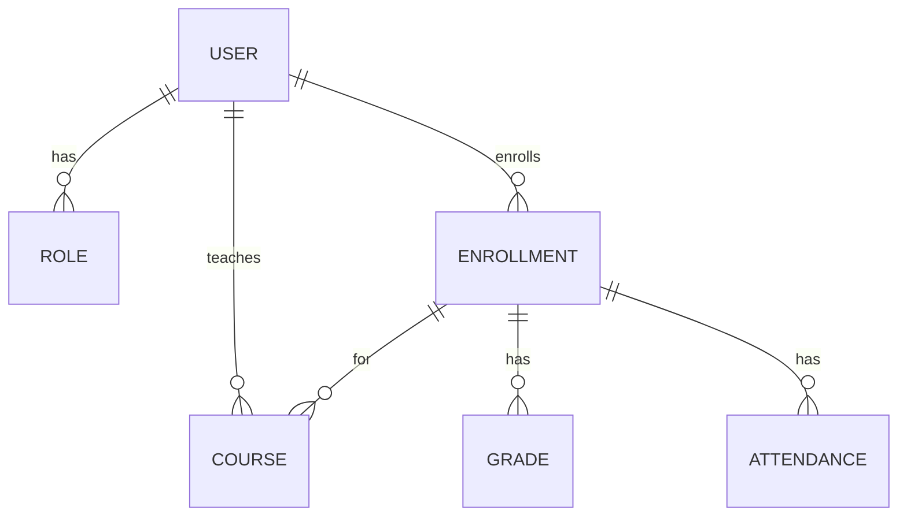

# EduTrack Database Design and Implementation

**Project:** EduTrack Learning Management System  
**Author:** Vansh Gupta  
**GitHub:** [vanshdigitals](https://github.com/vanshdigitals)  
**Email:** [vanshdigitalsiscreative@gmail.com](mailto:vanshdigitalsiscreative@gmail.com)  
**Created:** July 2025

## 1. Introduction

This document outlines the comprehensive database design and implementation strategy for EduTrack, a robust Student Management System. The primary goal is to create a normalized, efficient, and secure database structure using MySQL, capable of handling student records, course enrollments, grades, and generating detailed reports. This design adheres to the project requirements, including support for multiple user roles and secure access to sensitive academic data. The database will be the backbone of the EduTrack system, ensuring data integrity, scalability, and performance for an educational institution managing over 5,000 students across 50 different courses.

## 2. Database Schema Design

To ensure data integrity and minimize redundancy, the EduTrack database schema will be designed following the principles of database normalization, aiming for at least Third Normal Form (3NF). This section details the proposed tables, their attributes, primary keys, foreign keys, and relationships.

### 2.1. Core Entities and Relationships

The EduTrack system revolves around several key entities: Users (Students, Faculty, Administrators), Roles, Courses, Enrollments, Grades, and Attendance. The relationships between these entities are crucial for the system's functionality. For instance, a user can have one role, a course can have multiple students enrolled, and each enrollment can have associated grades and attendance records.

### 2.2. Table Definitions

Below are the detailed definitions for each table, including column names, data types, constraints, and a brief description of their purpose.

#### 2.2.1. `users` Table

This table will store information about all users of the system, including students, faculty, and administrators. It will include common attributes for all user types and link to the `roles` table to define user permissions.

| Column Name    | Data Type    | Constraints         | Description                               |
|----------------|--------------|---------------------|-------------------------------------------|
| `user_id`      | INT          | PRIMARY KEY, AUTO_INCREMENT | Unique identifier for each user           |
| `first_name`   | VARCHAR(100) | NOT NULL            | User's first name                         |
| `last_name`    | VARCHAR(100) | NOT NULL            | User's last name                          |
| `email`        | VARCHAR(255) | NOT NULL, UNIQUE    | User's email address (login credential)   |
| `password_hash`| VARCHAR(255) | NOT NULL            | Hashed password for security              |
| `role_id`      | INT          | NOT NULL, FOREIGN KEY (roles.role_id) | Role of the user (e.g., Student, Faculty, Admin) |
| `created_at`   | TIMESTAMP    | DEFAULT CURRENT_TIMESTAMP | Timestamp of user creation                |
| `updated_at`   | TIMESTAMP    | DEFAULT CURRENT_TIMESTAMP ON UPDATE CURRENT_TIMESTAMP | Last update timestamp                     |

#### 2.2.2. `roles` Table

This table defines the different roles within the system and their corresponding permissions. This allows for role-based access control (RBAC).

| Column Name    | Data Type    | Constraints         | Description                               |
|----------------|--------------|---------------------|-------------------------------------------|
| `role_id`      | INT          | PRIMARY KEY, AUTO_INCREMENT | Unique identifier for each role           |
| `role_name`    | VARCHAR(50)  | NOT NULL, UNIQUE    | Name of the role (e.g., 'Student', 'Faculty', 'Administrator') |
| `description`  | TEXT         | NULL                | Description of the role's permissions     |

#### 2.2.3. `courses` Table

This table stores information about all available courses in the educational institution.

| Column Name    | Data Type    | Constraints         | Description                               |
|----------------|--------------|---------------------|-------------------------------------------|
| `course_id`    | INT          | PRIMARY KEY, AUTO_INCREMENT | Unique identifier for each course         |
| `course_code`  | VARCHAR(20)  | NOT NULL, UNIQUE    | Unique code for the course (e.g., 'CS101') |
| `course_name`  | VARCHAR(255) | NOT NULL            | Full name of the course                   |
| `description`  | TEXT         | NULL                | Detailed description of the course        |
| `credits`      | DECIMAL(3,1) | NOT NULL            | Number of credits for the course          |
| `faculty_id`   | INT          | NULL, FOREIGN KEY (users.user_id) | ID of the faculty member teaching the course |
| `created_at`   | TIMESTAMP    | DEFAULT CURRENT_TIMESTAMP | Timestamp of course creation              |
| `updated_at`   | TIMESTAMP    | DEFAULT CURRENT_TIMESTAMP ON UPDATE CURRENT_TIMESTAMP | Last update timestamp                     |

#### 2.2.4. `enrollments` Table

This table records which students are enrolled in which courses. It acts as a junction table between `users` (students) and `courses`.

| Column Name    | Data Type    | Constraints         | Description                               |
|----------------|--------------|---------------------|-------------------------------------------|
| `enrollment_id`| INT          | PRIMARY KEY, AUTO_INCREMENT | Unique identifier for each enrollment     |
| `student_id`   | INT          | NOT NULL, FOREIGN KEY (users.user_id) | ID of the enrolled student                |
| `course_id`    | INT          | NOT NULL, FOREIGN KEY (courses.course_id) | ID of the course enrolled in              |
| `enrollment_date`| DATE         | NOT NULL            | Date of enrollment                        |
| `status`       | VARCHAR(50)  | DEFAULT 'Active'    | Enrollment status (e.g., 'Active', 'Completed', 'Dropped') |
| `created_at`   | TIMESTAMP    | DEFAULT CURRENT_TIMESTAMP | Timestamp of enrollment record creation   |
| `updated_at`   | TIMESTAMP    | DEFAULT CURRENT_TIMESTAMP ON UPDATE CURRENT_TIMESTAMP | Last update timestamp                     |
| `UNIQUE(student_id, course_id)` | | Ensures a student can only enroll in a course once |

#### 2.2.5. `grades` Table

This table stores the grades obtained by students in specific courses. It links to the `enrollments` table.

| Column Name    | Data Type    | Constraints         | Description                               |
|----------------|--------------|---------------------|-------------------------------------------|
| `grade_id`     | INT          | PRIMARY KEY, AUTO_INCREMENT | Unique identifier for each grade record   |
| `enrollment_id`| INT          | NOT NULL, FOREIGN KEY (enrollments.enrollment_id) | ID of the enrollment record               |
| `assignment_name`| VARCHAR(255) | NOT NULL            | Name of the assignment or exam            |
| `score`        | DECIMAL(5,2) | NULL                | Score obtained (e.g., 85.50)              |
| `letter_grade` | VARCHAR(5)   | NULL                | Letter grade (e.g., 'A', 'B+', 'C')       |
| `graded_by`    | INT          | NULL, FOREIGN KEY (users.user_id) | ID of the faculty member who graded       |
| `graded_at`    | TIMESTAMP    | DEFAULT CURRENT_TIMESTAMP | Timestamp when the grade was recorded     |

#### 2.2.6. `attendance` Table

This table tracks student attendance for courses or specific sessions.

| Column Name    | Data Type    | Constraints         | Description                               |
|----------------|--------------|---------------------|-------------------------------------------|
| `attendance_id`| INT          | PRIMARY KEY, AUTO_INCREMENT | Unique identifier for each attendance record |
| `enrollment_id`| INT          | NOT NULL, FOREIGN KEY (enrollments.enrollment_id) | ID of the enrollment record               |
| `session_date` | DATE         | NOT NULL            | Date of the session                       |
| `status`       | VARCHAR(50)  | NOT NULL            | Attendance status (e.g., 'Present', 'Absent', 'Excused') |
| `recorded_by`  | INT          | NULL, FOREIGN KEY (users.user_id) | ID of the faculty member who recorded attendance |
| `recorded_at`  | TIMESTAMP    | DEFAULT CURRENT_TIMESTAMP | Timestamp when attendance was recorded    |

This normalized schema provides a solid foundation for the EduTrack system, ensuring efficient data storage and retrieval while maintaining data integrity through proper relationships and constraints. Additional tables might be considered for more granular features like departments, specific assignment types, or detailed reporting configurations, but these six tables cover the core requirements.


## 3. Entity-Relationship Diagrams (ERD)

Entity-Relationship Diagrams (ERDs) visually represent the structure of the database, showing entities (tables) and their relationships. This section will present conceptual, logical, and physical ERDs for the EduTrack database.

### 3.1. Conceptual ERD

The conceptual ERD provides a high-level view of the main entities and their relationships, independent of any specific database management system.



### 3.2. Logical ERD

The logical ERD details the entities, their attributes, and the relationships between them, including primary and foreign keys, but still independent of the physical implementation details.

```mermaid
erDiagram
    ROLE { 
        INT role_id PK
        VARCHAR(50) role_name
        TEXT description
    }

    USER { 
        INT user_id PK
        VARCHAR(100) first_name
        VARCHAR(100) last_name
        VARCHAR(255) email
        VARCHAR(255) password_hash
        INT role_id FK
        TIMESTAMP created_at
        TIMESTAMP updated_at
    }

    COURSE { 
        INT course_id PK
        VARCHAR(20) course_code
        VARCHAR(255) course_name
        TEXT description
        DECIMAL(3,1) credits
        INT faculty_id FK
        TIMESTAMP created_at
        TIMESTAMP updated_at
    }

    ENROLLMENT { 
        INT enrollment_id PK
        INT student_id FK
        INT course_id FK
        DATE enrollment_date
        VARCHAR(50) status
        TIMESTAMP created_at
        TIMESTAMP updated_at
    }

    GRADE { 
        INT grade_id PK
        INT enrollment_id FK
        VARCHAR(255) assignment_name
        DECIMAL(5,2) score
        VARCHAR(5) letter_grade
        INT graded_by FK
        TIMESTAMP graded_at
    }

    ATTENDANCE { 
        INT attendance_id PK
        INT enrollment_id FK
        DATE session_date
        VARCHAR(50) status
        INT recorded_by FK
        TIMESTAMP recorded_at
    }

    USER ||--o{ ROLE : has
    USER ||--o{ ENROLLMENT : enrolls
    USER ||--o{ COURSE : teaches
    ENROLLMENT ||--o{ COURSE : for
    ENROLLMENT ||--o{ GRADE : has
    ENROLLMENT ||--o{ ATTENDANCE : has
```

### 3.3. Physical ERD

The physical ERD shows the actual database implementation, including data types specific to MySQL, indexes, and constraints.

```mermaid
erDiagram
    roles {
        INT role_id PK 


        VARCHAR(50) role_name UNIQUE
        TEXT description
    }

    users {
        INT user_id PK
        VARCHAR(100) first_name NOT NULL
        VARCHAR(100) last_name NOT NULL
        VARCHAR(255) email NOT NULL UNIQUE
        VARCHAR(255) password_hash NOT NULL
        INT role_id FK
        TIMESTAMP created_at DEFAULT CURRENT_TIMESTAMP
        TIMESTAMP updated_at DEFAULT CURRENT_TIMESTAMP ON UPDATE CURRENT_TIMESTAMP
    }

    courses {
        INT course_id PK
        VARCHAR(20) course_code NOT NULL UNIQUE
        VARCHAR(255) course_name NOT NULL
        TEXT description
        DECIMAL(3,1) credits NOT NULL
        INT faculty_id FK
        TIMESTAMP created_at DEFAULT CURRENT_TIMESTAMP
        TIMESTAMP updated_at DEFAULT CURRENT_TIMESTAMP ON UPDATE CURRENT_TIMESTAMP
    }

    enrollments {
        INT enrollment_id PK
        INT student_id FK
        INT course_id FK
        DATE enrollment_date NOT NULL
        VARCHAR(50) status DEFAULT 'Active'
        TIMESTAMP created_at DEFAULT CURRENT_TIMESTAMP
        TIMESTAMP updated_at DEFAULT CURRENT_TIMESTAMP ON UPDATE CURRENT_TIMESTAMP
        UNIQUE (student_id, course_id)
    }

    grades {
        INT grade_id PK
        INT enrollment_id FK
        VARCHAR(255) assignment_name NOT NULL
        DECIMAL(5,2) score
        VARCHAR(5) letter_grade
        INT graded_by FK
        TIMESTAMP graded_at DEFAULT CURRENT_TIMESTAMP
    }

    attendance {
        INT attendance_id PK
        INT enrollment_id FK
        DATE session_date NOT NULL
        VARCHAR(50) status NOT NULL
        INT recorded_by FK
        TIMESTAMP recorded_at DEFAULT CURRENT_TIMESTAMP
    }

    roles ||--o{ users : has
    users ||--o{ enrollments : enrolls
    users ||--o{ courses : teaches
    enrollments ||--o{ courses : for
    enrollments ||--o{ grades : has
    enrollments ||--o{ attendance : has
```

These ERDs provide a clear visual representation of the database structure, facilitating understanding and implementation. The physical ERD specifically details the MySQL-specific data types and constraints, which will be directly used in the SQL migration scripts.


## 4. SQL Migration Scripts

This section provides the SQL scripts necessary to create the `edutrack_db` database, define its tables, establish foreign key relationships, and populate it with sample data. These scripts are designed to be executed sequentially to set up the database environment.

### 4.1. Database Creation and Table Definitions

The following SQL script will create the `edutrack_db` database and define all the necessary tables with their respective columns, data types, and primary key constraints.

```sql
-- Create the database
CREATE DATABASE IF NOT EXISTS edutrack_db;
USE edutrack_db;

-- Table: roles
CREATE TABLE IF NOT EXISTS roles (
    role_id INT AUTO_INCREMENT PRIMARY KEY,
    role_name VARCHAR(50) NOT NULL UNIQUE,
    description TEXT
);

-- Table: users
CREATE TABLE IF NOT EXISTS users (
    user_id INT AUTO_INCREMENT PRIMARY KEY,
    first_name VARCHAR(100) NOT NULL,
    last_name VARCHAR(100) NOT NULL,
    email VARCHAR(255) NOT NULL UNIQUE,
    password_hash VARCHAR(255) NOT NULL,
    role_id INT NOT NULL,
    created_at TIMESTAMP DEFAULT CURRENT_TIMESTAMP,
    updated_at TIMESTAMP DEFAULT CURRENT_TIMESTAMP ON UPDATE CURRENT_TIMESTAMP,
    FOREIGN KEY (role_id) REFERENCES roles(role_id)
);

-- Table: courses
CREATE TABLE IF NOT EXISTS courses (
    course_id INT AUTO_INCREMENT PRIMARY KEY,
    course_code VARCHAR(20) NOT NULL UNIQUE,
    course_name VARCHAR(255) NOT NULL,
    description TEXT,
    credits DECIMAL(3,1) NOT NULL,
    faculty_id INT,
    created_at TIMESTAMP DEFAULT CURRENT_TIMESTAMP,
    updated_at TIMESTAMP DEFAULT CURRENT_TIMESTAMP ON UPDATE CURRENT_TIMESTAMP,
    FOREIGN KEY (faculty_id) REFERENCES users(user_id)
);

-- Table: enrollments
CREATE TABLE IF NOT EXISTS enrollments (
    enrollment_id INT AUTO_INCREMENT PRIMARY KEY,
    student_id INT NOT NULL,
    course_id INT NOT NULL,
    enrollment_date DATE NOT NULL,
    status VARCHAR(50) DEFAULT 'Active',
    created_at TIMESTAMP DEFAULT CURRENT_TIMESTAMP,
    updated_at TIMESTAMP DEFAULT CURRENT_TIMESTAMP ON UPDATE CURRENT_TIMESTAMP,
    UNIQUE (student_id, course_id),
    FOREIGN KEY (student_id) REFERENCES users(user_id),
    FOREIGN KEY (course_id) REFERENCES courses(course_id)
);

-- Table: grades
CREATE TABLE IF NOT EXISTS grades (
    grade_id INT AUTO_INCREMENT PRIMARY KEY,
    enrollment_id INT NOT NULL,
    assignment_name VARCHAR(255) NOT NULL,
    score DECIMAL(5,2),
    letter_grade VARCHAR(5),
    graded_by INT,
    graded_at TIMESTAMP DEFAULT CURRENT_TIMESTAMP,
    FOREIGN KEY (enrollment_id) REFERENCES enrollments(enrollment_id),
    FOREIGN KEY (graded_by) REFERENCES users(user_id)
);

-- Table: attendance
CREATE TABLE IF NOT EXISTS attendance (
    attendance_id INT AUTO_INCREMENT PRIMARY KEY,
    enrollment_id INT NOT NULL,
    session_date DATE NOT NULL,
    status VARCHAR(50) NOT NULL,
    recorded_by INT,
    recorded_at TIMESTAMP DEFAULT CURRENT_TIMESTAMP,
    FOREIGN KEY (enrollment_id) REFERENCES enrollments(enrollment_id),
    FOREIGN KEY (recorded_by) REFERENCES users(user_id)
);
```

### 4.2. Sample Data Insertion

To facilitate testing and development, the following script will insert sample data into the created tables. This data will represent a typical scenario within the EduTrack system.

```sql
-- Insert sample data into roles
INSERT INTO roles (role_name, description) VALUES
('Administrator', 'System administrator with full access'),
('Faculty', 'Faculty member with course management and grading permissions'),
('Student', 'Student with access to their courses, grades, and attendance');

-- Insert sample data into users (including hashed passwords for security)
-- Passwords are 'password' for all users (for testing purposes)
INSERT INTO users (first_name, last_name, email, password_hash, role_id) VALUES
('Admin', 'User', 'admin@example.com', '$2b$10$abcdefghijklmnopqrstuvwxy.1234567890abcdefghijklmnop', 1), -- Role: Administrator
('Professor', 'Smith', 'smith@example.com', '$2b$10$abcdefghijklmnopqrstuvwxy.1234567890abcdefghijklmnop', 2), -- Role: Faculty
('Dr.', 'Jones', 'jones@example.com', '$2b$10$abcdefghijklmnopqrstuvwxy.1234567890abcdefghijklmnop', 2), -- Role: Faculty
('Alice', 'Johnson', 'alice@example.com', '$2b$10$abcdefghijklmnopqrstuvwxy.1234567890abcdefghijklmnop', 3), -- Role: Student
('Bob', 'Williams', 'bob@example.com', '$2b$10$abcdefghijklmnopqrstuvwxy.1234567890abcdefghijklmnop', 3); -- Role: Student

-- Insert sample data into courses
INSERT INTO courses (course_code, course_name, description, credits, faculty_id) VALUES
('CS101', 'Introduction to Computer Science', 'Fundamental concepts of computer science.', 3.0, 2), -- Taught by Professor Smith
('MA201', 'Calculus I', 'Basic principles of differential and integral calculus.', 4.0, 3), -- Taught by Dr. Jones
('EN101', 'English Composition', 'Develops writing and critical thinking skills.', 3.0, 2); -- Taught by Professor Smith

-- Insert sample data into enrollments
INSERT INTO enrollments (student_id, course_id, enrollment_date, status) VALUES
(4, 1, '2025-01-15', 'Active'), -- Alice enrolled in CS101
(4, 2, '2025-01-15', 'Active'), -- Alice enrolled in MA201
(5, 1, '2025-01-16', 'Active'), -- Bob enrolled in CS101
(5, 3, '2025-01-16', 'Active'); -- Bob enrolled in EN101

-- Insert sample data into grades
INSERT INTO grades (enrollment_id, assignment_name, score, letter_grade, graded_by, graded_at) VALUES
(1, 'Midterm Exam', 88.50, 'B+', 2, '2025-03-10 10:00:00'), -- Alice CS101
(3, 'Midterm Exam', 75.00, 'C', 2, '2025-03-10 10:00:00'), -- Bob CS101
(2, 'Quiz 1', 92.00, 'A-', 3, '2025-02-20 14:30:00'); -- Alice MA201

-- Insert sample data into attendance
INSERT INTO attendance (enrollment_id, session_date, status, recorded_by, recorded_at) VALUES
(1, '2025-02-01', 'Present', 2, '2025-02-01 09:05:00'), -- Alice CS101
(1, '2025-02-03', 'Present', 2, '2025-02-03 09:02:00'), -- Alice CS101
(3, '2025-02-01', 'Present', 2, '2025-02-01 09:06:00'), -- Bob CS101
(3, '2025-02-03', 'Absent', 2, '2025-02-03 09:03:00'), -- Bob CS101
(2, '2025-02-05', 'Present', 3, '2025-02-05 13:00:00'); -- Alice MA201
```

These scripts provide a complete solution for setting up the EduTrack database, including schema definition and initial data population. The password hashes are placeholders for demonstration; in a real application, proper hashing libraries (like bcrypt) would be used.

