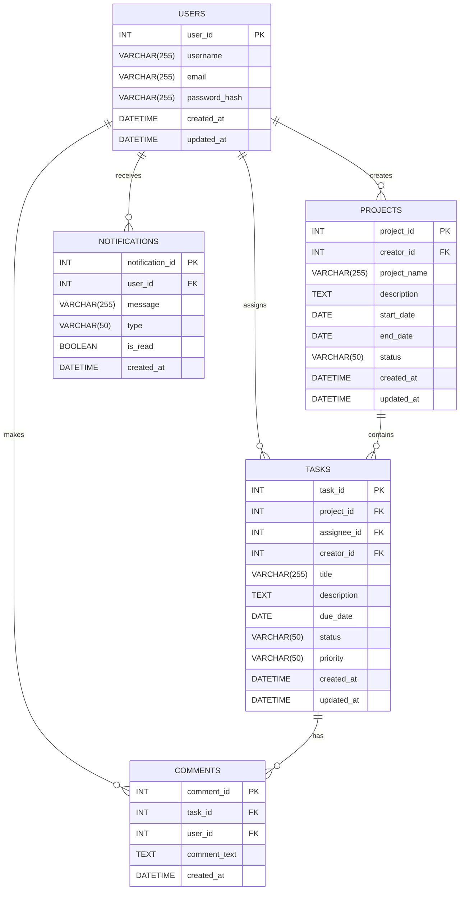

# TaskFlow Database Design and Implementation

This document outlines the database design for TaskFlow, a project management and collaboration tool. The database will be implemented using MySQL.

## 1. Introduction

TaskFlow aims to provide a robust and scalable backend for managing users, tasks, projects, comments, and notifications. A well-structured database is crucial for the application's performance and data integrity.

## 2. Database Schema Design

The database schema is designed to be normalized, minimizing data redundancy and improving data consistency. The core entities and their relationships are described below.

### Entities:

-   **Users**: Stores information about registered users.
-   **Projects**: Stores details about various projects.
-   **Tasks**: Represents individual tasks within projects.
-   **Comments**: Stores comments made on tasks.
-   **Notifications**: Manages notifications for users.

### Relationships:

-   A `User` can create multiple `Projects`.
-   A `Project` can have multiple `Tasks`.
-   A `Task` is assigned to one `User` (assignee) and created by another `User` (creator).
-   A `Task` can have multiple `Comments`.
-   A `Comment` is made by one `User`.
-   `Notifications` are sent to specific `Users`.

## 3. Entity-Relationship Diagram (ERD) - Conceptual



## 4. SQL Migration Scripts

Below are the SQL scripts to create the database and tables for TaskFlow. These scripts ensure the correct schema is set up with appropriate data types, constraints, and relationships.

```sql
-- Create the database
CREATE DATABASE IF NOT EXISTS taskflow_db;
USE taskflow_db;

-- Create the users table
CREATE TABLE IF NOT EXISTS users (
    user_id INT AUTO_INCREMENT PRIMARY KEY,
    username VARCHAR(255) NOT NULL UNIQUE,
    email VARCHAR(255) NOT NULL UNIQUE,
    password_hash VARCHAR(255) NOT NULL,
    created_at TIMESTAMP DEFAULT CURRENT_TIMESTAMP,
    updated_at TIMESTAMP DEFAULT CURRENT_TIMESTAMP ON UPDATE CURRENT_TIMESTAMP
);

-- Create the projects table
CREATE TABLE IF NOT EXISTS projects (
    project_id INT AUTO_INCREMENT PRIMARY KEY,
    creator_id INT NOT NULL,
    project_name VARCHAR(255) NOT NULL,
    description TEXT,
    start_date DATE,
    end_date DATE,
    status VARCHAR(50) DEFAULT 'Pending',
    created_at TIMESTAMP DEFAULT CURRENT_TIMESTAMP,
    updated_at TIMESTAMP DEFAULT CURRENT_TIMESTAMP ON UPDATE CURRENT_TIMESTAMP,
    FOREIGN KEY (creator_id) REFERENCES users(user_id) ON DELETE CASCADE
);

-- Create the tasks table
CREATE TABLE IF NOT EXISTS tasks (
    task_id INT AUTO_INCREMENT PRIMARY KEY,
    project_id INT NOT NULL,
    assignee_id INT,
    creator_id INT NOT NULL,
    title VARCHAR(255) NOT NULL,
    description TEXT,
    due_date DATE,
    status VARCHAR(50) DEFAULT 'To Do',
    priority VARCHAR(50) DEFAULT 'Medium',
    created_at TIMESTAMP DEFAULT CURRENT_TIMESTAMP,
    updated_at TIMESTAMP DEFAULT CURRENT_TIMESTAMP ON UPDATE CURRENT_TIMESTAMP,
    FOREIGN KEY (project_id) REFERENCES projects(project_id) ON DELETE CASCADE,
    FOREIGN KEY (assignee_id) REFERENCES users(user_id) ON DELETE SET NULL,
    FOREIGN KEY (creator_id) REFERENCES users(user_id) ON DELETE CASCADE
);

-- Create the comments table
CREATE TABLE IF NOT EXISTS comments (
    comment_id INT AUTO_INCREMENT PRIMARY KEY,
    task_id INT NOT NULL,
    user_id INT NOT NULL,
    comment_text TEXT NOT NULL,
    created_at TIMESTAMP DEFAULT CURRENT_TIMESTAMP,
    FOREIGN KEY (task_id) REFERENCES tasks(task_id) ON DELETE CASCADE,
    FOREIGN KEY (user_id) REFERENCES users(user_id) ON DELETE CASCADE
);

-- Create the notifications table
CREATE TABLE IF NOT EXISTS notifications (
    notification_id INT AUTO_INCREMENT PRIMARY KEY,
    user_id INT NOT NULL,
    message VARCHAR(255) NOT NULL,
    type VARCHAR(50),
    is_read BOOLEAN DEFAULT FALSE,
    created_at TIMESTAMP DEFAULT CURRENT_TIMESTAMP,
    FOREIGN KEY (user_id) REFERENCES users(user_id) ON DELETE CASCADE
);

-- Optional: Add some initial data (e.g., a default admin user)
-- INSERT INTO users (username, email, password_hash) VALUES ('admin', 'admin@taskflow.com', 'your_hashed_password_here');
```

## 5. Implementation Steps

1.  **Create Database and User**: Ensure `taskflow_db` and a user (e.g., `taskflow_user`) with appropriate privileges are created in MySQL.
2.  **Execute SQL Script**: Run the SQL script provided in Section 4 to create the tables.

This design provides a solid foundation for the TaskFlow backend, ensuring data integrity and efficient retrieval for all core functionalities. Additional tables and fields can be added as the application evolves to support more complex features.

